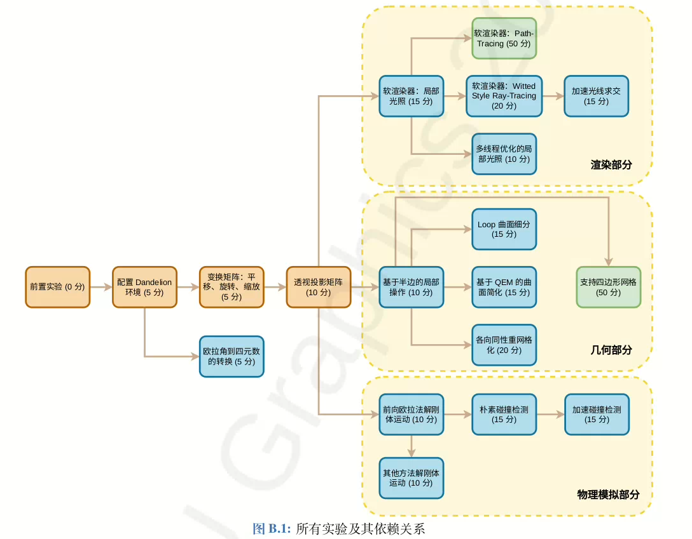

# Computer Graphic Rookie project
This is the complete project (i.e means you can get a perfect score) of XJTU COMP551805(Computer Graphic), which includes rendering, geometry, and physical simulations. 

# 这边我做了下面四个实验
### 2.1 欧拉角到四元数

### 2.2 软渲染器：局部光照
### 2.7 基于半边的局部操作
### 2.12 前向欧拉法模拟运动
### 2.13 其他方法解刚体运动

 
具体的实验内容均可以在实验文档中找到  
实验环境: dandelion （已fork）